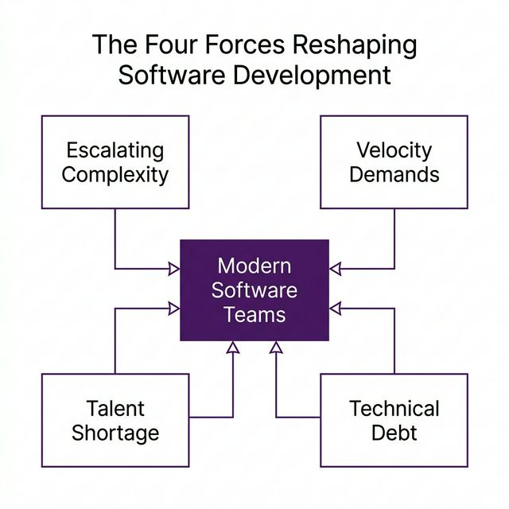
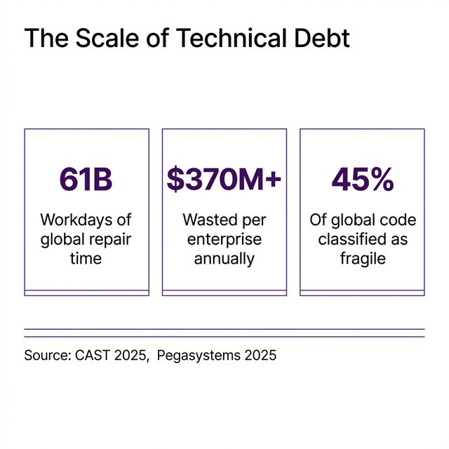
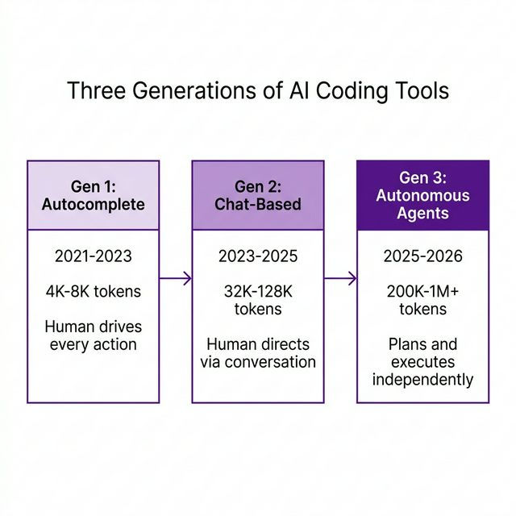
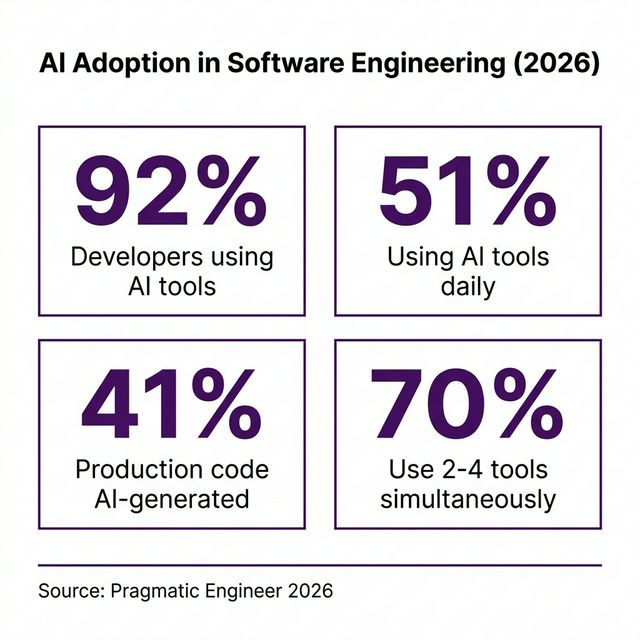
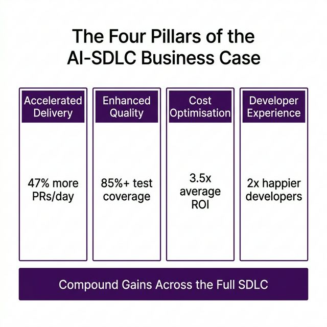
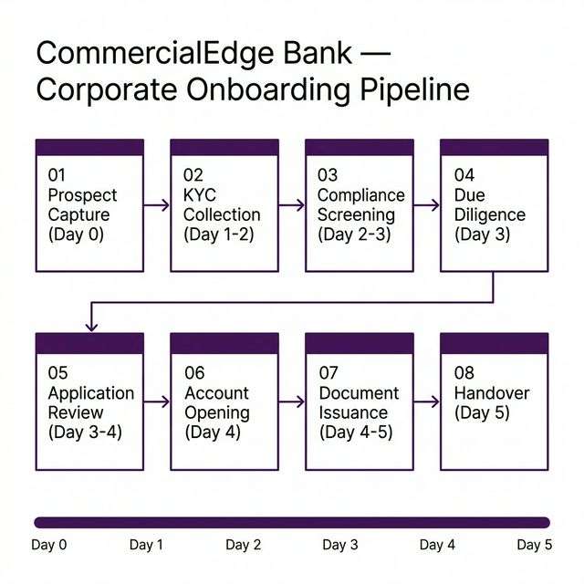
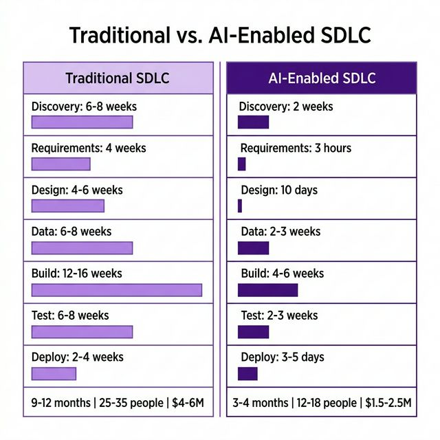
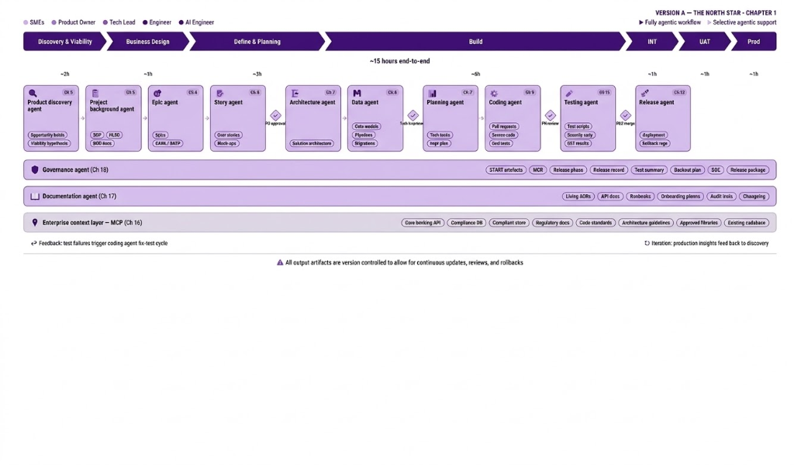

# Chapter 1: Introduction

Imagine you are the CTO of a mid-sized commercial bank. Your corporate onboarding process — the journey a new business client takes from first contact to active accounts — takes four weeks, involves six compliance checkpoints, and requires a small army of people manually shuffling documents, screening names against sanctions lists, and triple-checking regulatory boxes. Your board wants it done in five days.

Now imagine two parallel universes. In one, your team tackles this with a traditional software development lifecycle: months of workshops, manual coding, a QA team writing test cases by hand, and a deployment day that feels like defusing a bomb. In the other, your team uses the same SDLC — but with AI agents embedded in every phase, from requirements through production. Same project. Same regulations. Same compliance burden. Radically different outcomes.

This chapter is about that contrast. By the end, you will see — in concrete, measurable terms — why integrating AI across the SDLC is not just an efficiency play. It is a structural shift in how software gets built.

But first, let us understand why this shift is happening now.

---

## What You Will Learn

> 📖 **This chapter answers five questions:**
>
> 1. Why is the SDLC under more pressure today than ever before?
> 2. What is actually happening with AI in software engineering right now — beyond the hype?
> 3. What is the business case for AI across the full lifecycle (not just coding)?
> 4. What does the *same project* look like under a traditional SDLC vs. an AI-enabled one?
> 5. How does this book guide you through building an AI-augmented SDLC, chapter by chapter?

---

## 1.1 Why Now? – What are the Four Forces Reshaping Software Development?

To appreciate why AI integration into the SDLC matters, we need to understand the structural pressures bearing down on modern software organisations. **What are these pressures?** Think of them as four tectonic plates, all shifting at once.

### Force 1: Escalating Complexity

The software systems that enterprises depend on today are orders of magnitude more complex than those of even a decade ago. **Why does this matter?** A single customer-facing transaction in a modern bank may traverse dozens of microservices, compliance engines, and third-party integrations before completing.

Consider our banking use case. When a corporate client opens an account at CommercialEdge Bank, the request touches KYC verification, sanctions screening, beneficial ownership analysis, multiple compliance databases, a core banking system, and document generation services.

That is a massive ecosystem, and every connection is a potential failure point.

### Force 2: Velocity Demands

Here is the paradox: as systems get more complex, businesses expect them to ship *faster*. **What creates this pressure?** Digital-first competitors, regulatory changes requiring rapid system updates, and customer expectations shaped by consumer technology all compress delivery timelines.

So why are leaders asked to ship faster **and** safer? Because the market gives them no choice. Engineering leaders must ship more features, faster, while simultaneously improving security posture and reducing defect rates.

### Force 3: The Talent Shortage

The supply of software engineering talent has not kept pace. IDC projected a global shortfall of **four million developers** by 2025, and the U.S. Bureau of Labor Statistics forecasts software developer employment growing at roughly 15 percent from 2024 to 2034 — twice the average across all occupations.

The shortage is particularly acute in the specialisms that matter most: AI/ML engineering, cybersecurity, cloud-native architecture, and DevOps. IDC estimates that the IT talent shortage could cost organisations worldwide **$5.5 trillion** by 2026.

### Force 4: The Technical Debt Crisis

Think of technical debt as rust on a bridge — the more it accumulates, the less weight it can bear. Eventually, the whole structure becomes unsafe.

Technical debt has reached a scale that now threatens organisational agility at a systemic level. CAST's 2025 analysis of more than 10 billion lines of code found that global technical debt has reached **61 billion workdays** in estimated repair time. Nearly **45 percent** of the world's code was classified as fragile.

**Why does technical debt matter?** According to Pegasystems research, the average global enterprise wastes more than **$370 million annually** due to its inability to efficiently modernise legacy systems.

### Why These Forces Matter Together

Any one of these forces would be challenging. **What happens when they combine?** Together, they create an environment where traditional approaches to software delivery are reaching their limits. This is the context into which AI enters the SDLC — not as a novelty, but as a potential structural solution.

> **By the Numbers: The Pressure on Software Teams**
>
> | Metric | Value | Source |
> |--------|-------|--------|
> | Projected global developer shortfall | 4 million | IDC, 2025 |
> | Accumulated technical debt worldwide | 61 billion workdays | CAST, 2025 |
> | Annual waste per enterprise on legacy modernisation | $370M+ | Pegasystems, 2025 |
> | Global code classified as fragile | 45% | CAST, 2025 |
> | Projected losses from IT talent shortages by 2026 | $5.5 trillion | IDC |

---

## 1.2 What Is Actually Happening with AI in Software Engineering? – How have AI tools evolved?

Now that we've set the stage, let's look at how AI tools have evolved. The pressure is real — but what about the AI tools themselves? Are they ready? Let us look at the evidence.

### From Autocomplete to Autonomous Agents

The evolution of AI coding tools can be understood as a progression through three distinct generations, **what does each generation bring?** as illustrated in Figure 1.3.

The first generation, exemplified by early GitHub Copilot (2021–2023), provided inline code completions. Useful for reducing keystrokes, but no awareness of your project beyond the current file.

The second generation (2023–2025) introduced chat-based interfaces and expanded context awareness. You could *ask* the AI about your code, but it could not *act* on it.

The third and current generation (2025–2026) represents a paradigm shift toward **autonomous agency**. Tools such as Claude Code, OpenAI Codex, and GitHub Copilot's Agent Mode can read entire repositories, plan multi-step implementation strategies, execute code and tests, and iterate on their own output with minimal human supervision.

This is not autocomplete anymore. These are agents that *do the work*.

### Adoption: Beyond the Tipping Point

The adoption numbers tell a clear story. By early 2026:

- **92%** of developers use AI in at least one part of their workflow
- **51%** use AI tools daily
- **41%** of production code is AI-generated or AI-assisted
- **70%** of developers use between 2–4 AI tools simultaneously

Claude Code, despite launching only eight months prior, became the most widely used AI coding tool by early 2026 — rising from 4 percent of developers in May 2025 to 63 percent by February 2026. **What does this rapid rise imply?** It shows that developers quickly gravitate toward tools that demonstrably boost productivity.

### The Nuance: Why Faster Coding ≠ Faster Delivery

Here is where it gets interesting — and where the thesis of this book begins.

**What's the hidden bottleneck?** At the task level, controlled experiments consistently demonstrate **30 to 55 percent speed improvements**. Developers write code faster with AI. That part is not in dispute.

But a landmark randomised controlled trial by METR found something surprising: experienced open-source developers actually took **19 percent longer** on tasks when using early-2025 AI tools — despite self-reporting a 20 percent speedup.

Faros AI's analysis of over 10,000 developers confirmed that many organisations see **no measurable improvement in delivery velocity** despite faster individual coding.

**Why?** Because coding speed is only one bottleneck. Requirements that are vague. Architectures that are undocumented. Tests that are incomplete. Compliance evidence that is assembled retrospectively.

Speed alone isn't enough. AI makes coding faster — but if the rest of the lifecycle is still manual, the bottleneck simply moves.

> **The Core Insight**
>
> AI does not automatically improve the SDLC. **When does it help?** It improves the SDLC when integrated thoughtfully across *every* phase — from requirements through deployment and operations. This is what the rest of this book is about.

---

## 1.3 The Business Case: Why AI Across the Full SDLC – What’s the ROI?

If faster coding alone does not solve the problem, why bother? Because the gains from AI compound when you apply it across the *entire* lifecycle. Let us look at the four pillars of the business case.

### Pillar 1: Accelerated Delivery

AI tools reduce the time required for many individual development activities. **How much time?** Developers report saving 30 to 60 percent of their time on coding, test generation, and documentation tasks. Teams with high AI adoption touch 9 percent more tasks and handle **47 percent more pull requests per day**. Large enterprises have reported 28 percent increases in code shipment volume to production.

### Pillar 2: Enhanced Quality

AI-powered code review tools can identify patterns of technical debt accumulation, flag security vulnerabilities, and suggest architectural improvements. AI-driven test generation can achieve higher coverage more rapidly.

**What's the trade-off?** AI-generated code itself introduces quality risks if not properly governed. Roughly **62 percent** of developers report that AI tools increase technical debt, and code duplication is up approximately four-fold with AI-assisted coding.

Quality gains require the testing, review, and governance practices that this book covers in Chapters 10, 11, and 18.

### Pillar 3: Cost Optimisation

The AI in software development market was valued at approximately $933 million in 2025 and is projected to reach $15.7 billion by 2033. **What does this mean for investors?** Microsoft's market studies show AI investments returning an average of **3.5×**, with some organisations reporting returns as high as 8×.

### Pillar 4: Developer Experience

This one often gets overlooked, but it may be the most strategically important. **Why does happiness matter?** According to McKinsey research, developers who use AI tools are **twice as likely** to report feeling happier, more fulfilled, and regularly entering a flow state. Around 57 percent say AI tools make their job more enjoyable.

In a labour market where you cannot hire enough engineers, making the ones you have happier and more productive is a significant competitive advantage.

---

## 1.4 Meet CommercialEdge Bank: Our Running Use Case – Why this example?

Throughout this book, we ground everything in a single, end-to-end use case. Let us introduce it.

**CommercialEdge Bank** is a mid-sized commercial bank that is replacing its manual, paper-intensive corporate onboarding process — which currently takes an average of four weeks — with an end-to-end digital platform targeting a cycle time of three to five days.

Why this use case? Three reasons:

1. **It is genuinely complex.** Regulatory requirements, multi-stakeholder workflows, integration with legacy systems, and stringent data security needs.
2. **It exercises every SDLC phase.** Requirements, design, data engineering, coding, testing, deployment, operations, documentation, and governance — all substantively.
3. **The domain is data-rich and process-heavy.** Making it an excellent vehicle for demonstrating AI's value across the entire lifecycle.

The platform covers the full onboarding journey across eight stages. **What are those stages?**

| Stage | Onboarding Step | Target Day |
|-------|----------------|------------|
| 01 | Prospect capture & account type selection | Day 0 |
| 02 | KYC package collection | Day 1–2 |
| 03 | Compliance screening | Day 2–3 |
| 04 | Transaction Due Diligence (TDD) | Day 3 |
| 05 | Application review & quality check | Day 3–4 |
| 06 | Account opening (automated) | Day 4 |
| 07 | Document & instrument issuance | Day 4–5 |
| 08 | Handover & activation | Day 5 |

> **Use Case at a Glance**
>
> | Attribute | Detail |
> |-----------|--------|
> | Organisation | CommercialEdge Bank (mid-sized commercial bank) |
> | Project | Corporate Client Onboarding System |
> | Current state | Manual, 4-week cycle time |
> | Target state | Digital, 3–5 day cycle time |
> | Scope | 8 stages, 6 compliance checks, end-to-end |
> | Accounts | Corporate Current, Trade Finance, FCY, Cash Management, Credit Facility |

The question that naturally follows is: *what does it actually look like to build this system?* And how different is the experience when AI is embedded across every phase?

The next section answers both questions.

---

## 1.5 Two Paths, One Platform — Which path will you take?

This is the heart of the chapter. **Which path wins?** We are going to walk through the CommercialEdge Bank onboarding platform *twice*: once as it would be delivered through a traditional SDLC, and once through an AI-enabled agentic SDLC. Same requirements. Same regulations. Same business objectives. Different approach — and radically different outcomes.

### The Headline Numbers

Before we dive into the phase-by-phase comparison, here is the summary. Take a moment to absorb these numbers:

| Dimension | Traditional SDLC | AI-Enabled SDLC |
|-----------|------------------|-----------------|
| **End-to-end timeline** | 9–12 months | 3–4 months |
| **Discovery & requirements** | 8–10 weeks manual | 2–3 weeks AI-synthesised |
| **Design & architecture** | 4–6 weeks | 1–2 weeks |
| **Data engineering** | 6–8 weeks | 2–3 weeks |
| **Build (coding)** | 12–16 weeks | 4–6 weeks |
| **Testing & QA** | 6–8 weeks | 2–3 weeks |
| **Deployment & release** | 2–4 weeks | 3–5 days |
| **Documentation** | Perpetually behind | Living, auto-generated |
| **Team size** | 25–35 people | 12–18 people |
| **Estimated project cost** | $4–6M | $1.5–2.5M (60% reduction) |
| **Compliance readiness** | Weeks of audit preparation | Continuous from day one |

Let us walk through each phase to see *how* these differences arise.

### Phase 1: Discovery and Viability

Let's see how the two paths diverge in the discovery stage.

> 📊 **Figure 1.8: Discovery Phase Comparison** — Traditional vs. AI-Enabled discovery workflows *(image pending generation)*

**The Traditional Way.** The product manager schedules eight workshops over six weeks with compliance officers, relationship managers, operations leads, and IT. A business analyst manually synthesises findings into a 40-page opportunity assessment. Two review cycles follow. Three months in, a competitor launches same-day onboarding — the viability assumptions must be revisited, adding two more weeks.

**The AI-Enabled Way.** The Product Discovery Agent synthesises customer satisfaction surveys, support ticket data, competitive intelligence, and regulatory documentation in under four hours. It generates three testable hypotheses: digital KYC can reduce Stage 02 from two days to four hours; automated compliance screening can eliminate manual review for 80 percent of standard-risk cases; straight-through processing can achieve 80 percent auto-approval. The team validates with a rapid prototype tested with five relationship managers in a single day. Total discovery: **two weeks**.

*What you will learn: Chapter 5 covers AI-assisted discovery, spec-driven development with Kiro, and the bridge from product intent to engineering execution.*

### Phase 2: Requirements and Planning

**The Traditional Way.** The BA conducts 12 stakeholder workshops over four weeks, manually documenting 47 user stories in Jira. When a regulatory update invalidates eight stories two months in, the BA spends two weeks rewriting them.

**The AI-Enabled Way.** The Story Agent generates 47 user stories with EARS acceptance criteria from the validated spec in **three hours**. When the regulatory update arrives, the Governance Agent detects it within 24 hours, flags the affected stories, and generates revised criteria. Elapsed time for the rework: **two days**.

*What you will learn: Chapters 5 and 6 cover spec generation, AI-generated stories, and continuous regulatory monitoring.*

### Phase 3: Architecture and Design

**The Traditional Way.** Four weeks of architecture design. Two weeks for the Architecture Review Board approval. ADRs written after the fact, if at all.

**The AI-Enabled Way.** The Architecture Agent analyses the existing core banking codebase, approved patterns, and requirements. It proposes a microservices architecture, generates OpenAPI contracts, and produces design documents with sequence diagrams. Review by the tech lead — the human approval gate. Entire phase: **ten days**.

*What you will learn: Chapter 7 covers AI-recommended architectures and living ADRs.*

### Phase 4: Data Engineering

**The Traditional Way.** Three weeks for schema design. Six weeks hand-coding ETL pipelines. Test data created by masking production records — carrying compliance risk.

**The AI-Enabled Way.** The Data Agent generates the entity-relationship model from requirements, verified against the existing core banking schema. Self-healing pipelines auto-adapt when provider formats change. Synthetic data generation produces 500 realistic corporate client profiles in hours with **zero compliance exposure**.

*What you will learn: Chapter 8 covers AI-assisted data modelling, self-healing pipelines, and synthetic data generation.*

### Phase 5: Build (Coding)

Now let's look at where most people assume AI adds value — the coding phase itself.

> 📊 **Figure 1.9: Coding Phase Comparison** — Traditional vs. AI-Enabled coding workflows *(image pending generation)*

**The Traditional Way.** Eight developers work for 16 weeks. Pull request reviews average two-day turnaround. Context is lost when developers switch features.

**The AI-Enabled Way.** The Coding Agent implements tasks from the sequenced backlog, operating with full codebase context through the Enterprise Context Layer (MCP). PR turnaround drops to hours as AI-assisted code review catches common issues immediately. Same scope, **five developers in six weeks**.

*What you will learn: Chapter 9 covers agentic coding; Chapter 10 covers AI-augmented review.*

### Phase 6: Testing and Quality Assurance

**The Traditional Way.** Four weeks writing test cases manually, achieving 60 percent code coverage. Security testing bolted on at the end, revealing vulnerabilities that require emergency fixes.

**The AI-Enabled Way.** The Testing Agent generates test suites from acceptance criteria, achieving **85 percent coverage** from the first pass. Mutation testing validates that the tests actually catch bugs. Security scanning runs continuously from the first commit.

*What you will learn: Chapter 11 covers AI-generated tests, mutation testing, and continuous security scanning.*

### Phase 7: CI/CD and Deployment

**The Traditional Way.** Two-week deployment windows. A 47-item manual checklist. Untested rollbacks.

**The AI-Enabled Way.** Intelligent CI/CD pipelines run predictive builds that flag integration issues before staging. Canary deployments roll out safely. **Release in hours, not weeks.**

*What you will learn: Chapters 12 and 13 cover intelligent pipelines, predictive builds, and auto-rollback.*

### Phase 8: AI Agents in the Product Itself

**The Traditional Way.** All compliance screening is manual — 2.3 human touchpoints per check.

**The AI-Enabled Way.** Three production AI agents operate within the platform: a KYC Document Processing Agent, a Compliance Screening Agent, and an Onboarding Assistant Agent. Compliance processing drops from **weeks to hours**.

*What you will learn: Chapter 14 covers orchestration patterns, human-in-the-loop, and reliability engineering.*

### Phase 9: Governance, Documentation, and Infrastructure

**The Traditional Way.** Documentation written after development, if at all. Audits mean weeks of panic. Knowledge remains siloed.

**The AI-Enabled Way.** The Documentation Agent produces living ADRs, auto-generated API docs, and compliance trails from day one. The Governance Agent monitors the pipeline in parallel. The Enterprise Context Layer (MCP) provides unified cross-agent access.

*What you will learn: Chapters 16–21 cover MCP infrastructure, living docs, governance, economics, and legacy modernisation.*

### The Full Comparison

The following table consolidates the complete phase-by-phase contrast:

| SDLC Phase | Traditional | AI-Enabled | Chapters |
|------------|-------------|------------|----------|
| **Discovery & viability** | 6–8 weeks manual research | 2 weeks AI-synthesised | Ch 5 |
| **Requirements** | 12 workshops, 4 weeks; regulatory rewrite 2 weeks | Stories generated in 3 hours; regulatory rework in 2 days | Ch 5, 6 |
| **Architecture & design** | 4-week review board; ADRs after the fact | Architecture Agent proposes in hours; living ADRs | Ch 7 |
| **Data engineering** | Manual schema + masked production data | AI-generated schema + synthetic data (zero compliance risk) | Ch 8 |
| **Coding** | 8 devs, 16 weeks, 2-day PR turnaround | 5 devs, 6 weeks, PR turnaround in hours | Ch 9, 10 |
| **Testing** | Manual test cases, 60% coverage, security bolted on | AI-generated suites, 85%+ coverage, continuous scanning | Ch 11 |
| **CI/CD & deployment** | 2-week windows, manual checklists | Predictive builds, canary deploys, release in hours | Ch 12, 13 |
| **Production agents** | Manual compliance, 4-week cycle | 3 AI agents reduce processing to hours | Ch 14 |
| **Documentation** | Written after dev; audit panic | Living docs, always examination-ready | Ch 17 |
| **Infrastructure** | Bespoke integrations, siloed knowledge | Enterprise Context Layer (MCP) | Ch 16 |
| **Governance** | Manual compliance at phase gates | Continuous automated validation | Ch 18 |
| **Cost & ROI** | ROI by gut feel | DORA metrics, TCO modelling | Ch 19, 20 |
| **Legacy integration** | 8-week custom adapters | AI-assisted comprehension + auto-generated adapters | Ch 21 |

### What Could Go Wrong?

We would be doing you a disservice if we presented the AI-enabled path as risk-free. It is not. Here is what to watch for:

- **AI-generated code can introduce subtle bugs** that pass automated tests but fail in production
- **AI-induced technical debt** (code duplication, inconsistent patterns) accumulates when AI output is accepted without review
- **Over-trust** in AI recommendations can bypass critical human judgment
- **Hallucinated requirements or architecture decisions** can propagate through the pipeline if spec validation is inadequate
- **Token costs** for production AI agents can exceed projections if not actively managed

Every one of these risks is addressed in the relevant chapter: code quality in Chapters 9–10, testing in Chapter 11, governance in Chapter 18, and economics in Chapter 19.

> **The Key Takeaway**
>
> The contrast is not hypothetical. Every capability described in the AI-enabled column is achievable with tools and practices available today. But the gains do not come from adopting AI in any single phase. They come from the **compound effect** of AI integration across every phase of the lifecycle, connected by shared infrastructure, governed continuously, and measured rigorously.

---

## 1.6 Your Roadmap: How This Book Is Organised

This book mirrors the Software Development Lifecycle itself — progressing from foundational concepts through every SDLC phase, then addressing cross-cutting concerns, and concluding with legacy modernisation and real-world case studies. It comprises **22 chapters organised in six parts**:

> 📊 **Figure 1.10: Book Structure** — six parts from foundations through every SDLC phase to modernisation and case studies *(image pending generation)*

- **Part I — Foundations (Chapters 0–4):** Context, history, and the AI tool landscape
- **Part II — Product Lifecycle (Chapter 5):** PDLC — Discovery → Viability → Spec
- **Part III — SDLC Phases (Chapters 6–13):** Requirements → Design → Data → Code → Review → Test → CI/CD → Ops
- **Part IV — Production AI (Chapter 14):** AI agents as product components
- **Part V — Cross-Cutting (Chapters 15–20):** DX, Infrastructure, Docs, Governance, Economics, ROI
- **Part VI — Modernisation & Capstone (Chapters 21–22):** Legacy + Case Studies

### The Agentic SDLC Architecture

The diagram below illustrates the agentic SDLC architecture that this book prepares you to design, build, and govern. **Why this matters:** it is a fully instrumented development lifecycle where specialised AI agents own each phase, draw context from a shared enterprise infrastructure layer, operate under continuous governance, and are gated by human approval at critical decision points.

Think of the SDLC as a factory assembly line — AI agents are the robots on that line, each one specialised for a specific station. Each subsequent chapter deep-dives into one or more agents in this architecture.

> 📊 **Figure 1.11: The Agentic SDLC Architecture — the book's target state.**
>
> 

### Agent-to-Chapter Mapping

The following table maps each agent in the diagram to its corresponding book chapter. Use this as your navigation guide:

| Agent in Diagram | Book Chapter(s) | What You Will Learn |
|-----------------|-----------------|--------------------|
| Product Discovery Agent | Ch 5: AI-Powered PDLC | How AI compresses Discovery and Viability, spec-driven development with Kiro |
| Project Background Agent | Ch 6: AI-Assisted Requirements & Planning | AI-generated project documentation, SOPs, and background synthesis |
| Epic Agent + Story Agent | Ch 6: AI-Assisted Requirements & Planning | AI-generated epics, user stories, acceptance criteria in EARS notation |
| Architecture Agent | Ch 7: AI-Powered Design & Architecture | AI-recommended architectures, design doc generation, pattern selection |
| Data Agent | Ch 8: Data Engineering & Platform Architecture | AI-assisted data modelling, intelligent pipelines, document processing, synthetic data |
| Planning Agent | Ch 7: AI-Powered Design & Architecture | AI-generated implementation plans, task sequencing, dependency mapping |
| Coding Agent | Ch 9: Coding Agents & AI Pair Programming | Claude Code, Copilot, Cursor — agentic coding at scale |
| Testing Agent | Ch 11: AI-Driven Testing & QA | AI test generation, security scanning, mutation testing, visual regression |
| Release Agent | Ch 12–13: CI/CD and Deployment & Ops | Intelligent pipelines, predictive builds, AIOps, self-healing systems |
| Governance Agent | Ch 18: Governance, Security & Responsible AI | IP/licensing, code provenance, compliance automation, AI safety |
| Documentation Agent | Ch 17: AI-Driven Documentation & Knowledge Mgmt | Living ADRs, API docs, runbooks, audit trails, onboarding guides |
| Enterprise Context Layer (MCP) | Ch 16: AI Agent Infrastructure | MCP servers, tool use, enterprise integration, access control |
| Human Approval Gates (◆) | Ch 14 + Ch 18 | Human-in-the-loop design, graduated autonomy, regulated-industry governance |
| Feedback Loops (↩ ↻) | Ch 14: AI Agents in Production | Orchestration patterns, fix-test cycles, production-to-discovery iteration |

This architecture is not theoretical. Every component will be implemented for the CommercialEdge Bank onboarding platform across the chapters that follow.

### Chapter-by-Chapter Roadmap

| Ch | Title | SDLC Phase | Key Topics |
|----|-------|------------|------------|
| 2 | SDLC Fundamentals | Foundations | Waterfall, Agile, Lean, DevOps — phases and artifacts |
| 3 | Modern SDLC Models | Foundations | Continuous delivery, platform engineering, DevSecOps |
| 4 | AI Landscape for Software Engineering | Foundations | LLMs, foundation models, copilots, agents, tool taxonomy |
| 5 | AI-Powered PDLC | PDLC Bridge | Discovery, viability, Kiro, spec-driven development |
| 6 | AI-Assisted Requirements & Planning | Requirements | Story generation, spec analysis, estimation |
| 7 | AI-Powered Design & Architecture | Design | Architecture recommendations, design doc generation |
| 8 | Data Engineering & Platform Architecture | Data | Data modelling, pipelines, document processing, synthetic data |
| 9 | Coding Agents & AI Pair Programming | Build | Copilot, Cursor, Claude Code, Windsurf, agentic coding |
| 10 | AI-Augmented Code Review & Quality | Build | Automated review, refactoring, tech debt detection |
| 11 | AI-Driven Testing & QA | Verify | Test generation, mutation testing, visual regression |
| 12 | Intelligent CI/CD & DevOps | Release | Pipeline optimization, predictive builds, IaC |
| 13 | AI for Deployment, Monitoring & Ops | Operate | AIOps, anomaly detection, self-healing systems |
| 14 | AI Agents in Production | Operate | Orchestration, human-in-the-loop, guardrails, reliability |
| 15 | Developer Experience & Tooling | Cross-cutting | IDE integration, CLI tools, productivity measurement |
| 16 | AI Agent Infrastructure (MCP) | Cross-cutting | Tool use, MCP servers, enterprise integration |
| 17 | Documentation & Knowledge Management | Cross-cutting | Living ADRs, API docs, audit trails, onboarding |
| 18 | Governance, Security & Responsible AI | Cross-cutting | IP/licensing, code provenance, AI safety in SDLC |
| 19 | AI Economics & Vendor Strategy | Cross-cutting | Build vs. buy, token costs, TCO, vendor lock-in |
| 20 | Measuring SDLC Maturity & ROI | Cross-cutting | DORA metrics, maturity models, cost-benefit analysis |
| 21 | AI and Legacy Modernisation | Modernisation | Code comprehension, refactoring, migration, debt remediation |
| 22 | Case Studies & Adoption Playbook | Capstone | Real-world implementations, adoption roadmap |

In each subsequent chapter, we return to the CommercialEdge Bank use case to demonstrate how AI tools and practices apply to the relevant SDLC phase. Chapter 5 produces the spec artifacts. Chapter 6 generates requirements. Chapter 7 designs the architecture. Chapter 8 builds the data platform. Chapter 9 implements the code. And so on through deployment, governance, and beyond.

This continuity gives you a coherent, cumulative learning experience that mirrors how AI integration works on a real project.

---

## Key Takeaways

Let us recap the big ideas from this chapter:

- **The SDLC is under structural pressure.** A projected global shortfall of four million developers, 61 billion workdays of accumulated technical debt, and accelerating complexity create an environment where traditional approaches alone cannot scale.

- **AI has crossed the adoption threshold.** Over 90 percent of developers now use AI tools in their workflow, and autonomous coding agents represent a qualitative leap beyond earlier autocomplete and chat-based assistants.

- **Task-level gains do not automatically translate to organisational productivity.** Realising the full value of AI requires integration across the entire SDLC — not just faster coding.

- **The same project, two radically different outcomes.** The CommercialEdge Bank onboarding platform demonstrates that AI-enabled SDLC can reduce timelines from 9–12 months to 3–4 months, team sizes from 25–35 to 12–18, and costs by roughly 60 percent — while improving quality and compliance readiness.

- **The business case is compelling but conditional.** AI-enabled gains compound when pursued across every phase. In isolation, benefits may be marginal or offset by new risks such as AI-induced technical debt and over-trust.

- **Each of the 22 chapters maps to a specific phase.** The book follows the CommercialEdge Bank use case from discovery through deployment and beyond, with every chapter building on the artifacts produced in the previous one.

---

## Further Reading

1. CAST, *"Coding in the Red: The State of Global Technical Debt 2025,"* castsoftware.com/CIU (2025). Analysis of 10 billion lines of code quantifying global technical debt.
2. METR, *"Measuring the Impact of Early-2025 AI on Experienced Open-Source Developer Productivity,"* metr.org (2025). Randomised controlled trial of AI tool impact on experienced developers.
3. Faros AI, *"The AI Productivity Paradox Report 2025,"* faros.ai (2025). Telemetry analysis from 10,000+ developers on AI's impact on delivery metrics.
4. The Pragmatic Engineer, *"AI Tooling for Software Engineers in 2026,"* newsletter.pragmaticengineer.com (2026). Comprehensive survey of AI tool adoption and usage patterns.
5. McKinsey, *"How an AI-Enabled Software Product Development Life Cycle Will Fuel Innovation,"* mckinsey.com (2025). Five critical shifts AI brings to the PDLC.
6. McKinsey/QuantumBlack, *"Unlocking the Value of AI in Software Development,"* mckinsey.com (2025). Survey of ~300 companies on what distinguishes top AI performers.
7. Pegasystems / Savanta, *"Technical Debt and Legacy Transformation Study,"* pega.com (2025). Enterprise survey on the financial impact of technical debt.
8. IDC, *"Global Developer and IT Professional Shortage Forecast,"* (2025). Projection of worldwide software talent shortfalls and economic impact.
9. GitHub, *"Octoverse 2024: The State of Open Source and AI,"* github.blog (2024). Data on AI's impact on open-source contribution patterns.
10. McKinsey & Company, *"The Economic Potential of Generative AI: Developer Productivity and Satisfaction,"* mckinsey.com (2024). Research on AI's impact on developer wellbeing and flow states.
11. Gartner, *"2025 CIO and Technology Executive Survey,"* gartner.com (2025). Enterprise AI adoption forecasts.
12. U.S. Bureau of Labor Statistics, *"Occupational Outlook Handbook: Software Developers,"* bls.gov (2024). Employment growth projections through 2034.

---

*Next: [Chapter 2 — SDLC Fundamentals](../02-sdlc-fundamentals/chapter.md)*
