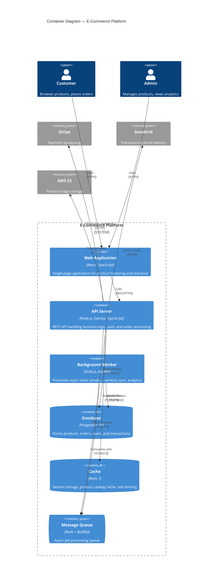
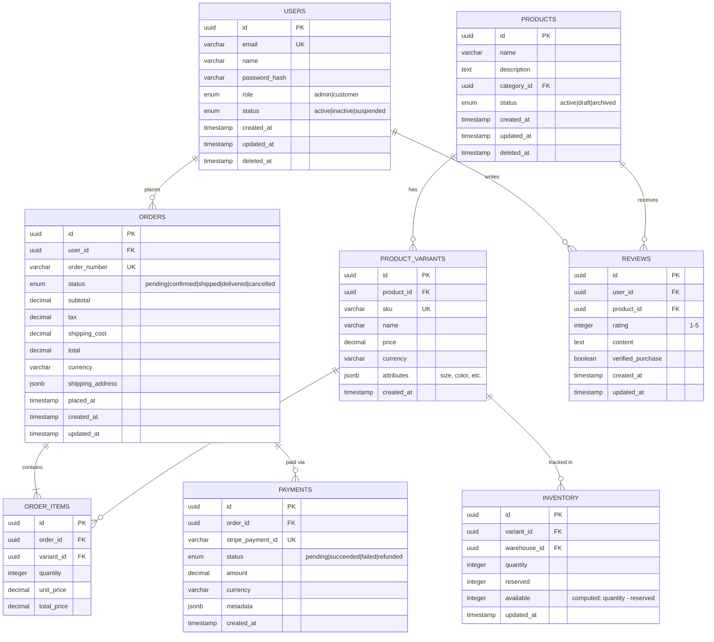

# Chapter 7: AI-Powered Design & Architecture

> *"Architecture is the decisions that are hard to change. AI doesn't make those decisions less important — it makes exploring the decision space faster, so you can make better decisions with more evidence and less guesswork."*
> — Martin Fowler, adapted for the AI era

---

## Overview

Software architecture is the skeleton of every system — the set of decisions that are expensive to reverse. Traditionally, architecture has been the domain of senior engineers with years of pattern recognition. AI transforms this discipline not by replacing the architect, but by dramatically expanding the *design space* that can be explored, the *documentation* that can be generated, and the *validation* that can be performed — all before a single line of production code is written. This chapter covers AI-assisted architecture exploration, design document generation, automated diagramming, API design, and data modeling with enterprise-grade frameworks.

## Learning Objectives

After reading this chapter, you will be able to:

- Use AI to explore, compare, and evaluate architecture options systematically
- Generate high-quality design documents (HLDs, LLDs, ADRs) with AI assistance
- Create and maintain architecture diagrams using AI-powered tools
- Design APIs using AI-assisted contract-first development
- Build data models with AI-generated ERDs and migration plans
- Establish governance around AI-assisted architectural decisions

---

## 6.1 Architecture Exploration with AI

### The Architecture Decision Space

Every software system requires hundreds of architectural decisions. Traditional approaches rely on the architect's experience and pattern library. AI expands this by generating and evaluating options the architect may not have considered:

| Decision Category | Examples | # of Viable Options | AI Value |
|------------------|---------|-------------------|---------| 
| **Deployment topology** | Monolith, microservices, modular monolith, serverless | 4–6 | Compare trade-offs |
| **Data storage** | SQL, NoSQL, graph, time-series, polyglot | 5–10 | Match to access patterns |
| **Communication** | REST, gRPC, GraphQL, event streaming, message queues | 5–8 | Evaluate latency, coupling |
| **Caching strategy** | No cache, read-through, write-behind, CDN, edge | 4–6 | Model hit ratios |
| **Authentication** | Session, JWT, OAuth2, SAML, passkeys | 5–7 | Assess security trade-offs |

### AI-Assisted Trade-Off Analysis

The most valuable use of AI in architecture is **rapid trade-off analysis** across multiple dimensions:

```markdown
# Architecture Trade-Off Analysis Prompt

You are a senior software architect evaluating architecture options 
for a new system. Analyze each option across these dimensions:

## System Context
[Describe the system: domain, scale, team size, constraints]

We are building a real-time analytics platform that ingests 
50,000 events/second from IoT devices, stores time-series data 
for 2 years, and serves dashboards with <500ms query response 
time. Team of 8 engineers. AWS-only deployment.

## Options to Compare
1. Microservices with Kafka + TimescaleDB
2. Serverless with Kinesis + DynamoDB + Athena
3. Modular monolith with Redis Streams + ClickHouse

## Evaluation Dimensions
For each option, score 1-10 and explain:
| Dimension | Description |
|-----------|-------------|
| **Scalability** | Can it handle 10x growth? |
| **Latency** | Can it meet <500ms query SLA? |
| **Operational complexity** | How many services to manage? |
| **Cost at scale** | Estimated monthly cost at full load |
| **Team fit** | Can 8 engineers build and maintain this? |
| **Time to MVP** | How long to first working version? |
| **Extensibility** | How easy to add new data sources? |

## Output Format
- Comparison matrix with scores
- Recommendation with rationale
- Risk mitigation plan for the recommended option
- Decision record (ADR format)
```

#### AI-Generated Trade-Off Matrix (Example Output)

| Dimension | Microservices + Kafka + TimescaleDB | Serverless + Kinesis + DynamoDB | Modular Monolith + ClickHouse |
|-----------|-----|-----|-----|
| **Scalability** | 9 — Kafka handles massive throughput | 10 — Auto-scales fully | 7 — Single binary; manual scaling |
| **Latency** | 8 — TimescaleDB optimized for time-series | 6 — DynamoDB scan latency for complex queries | 9 — ClickHouse built for fast analytics |
| **Ops Complexity** | 4 — 5+ services, Kafka cluster management | 7 — Managed services reduce ops burden | 9 — Single deployment; minimal ops |
| **Cost at Scale** | 5 — Kafka + DB infra costs | 7 — Pay-per-request at low volumes; expensive at high* | 8 — ClickHouse is cost-efficient for analytics |
| **Team Fit (8 eng)** | 5 — Kafka expertise needed; service boundaries | 7 — Less infra; more API wiring | 9 — Single codebase; familiar patterns |
| **Time to MVP** | 6 — Service setup overhead | 8 — Faster with managed services | 9 — Fastest to first version |
| **Extensibility** | 9 — New source = new consumer | 8 — New Lambda per source | 7 — New module; deploy whole app |
| **Total** | **46** | **53** | **58** |

> 💡 **Enterprise Insight:** AI-generated trade-off matrices are *starting points for discussion*, not final decisions. The real value is that AI forces structured evaluation across dimensions that teams often skip. The architect's role shifts from *generating options* to *validating and refining* AI-generated analysis with domain expertise.

### Architecture Fitness Functions with AI

AI can help define and monitor **architecture fitness functions** — automated tests that verify your architecture maintains its intended qualities:

```typescript
// Architecture fitness functions validated by AI analysis

interface FitnessFunction {
  name: string;
  dimension: 'performance' | 'security' | 'maintainability' | 'scalability';
  threshold: string;
  measurement: string;
}

const architectureFitnessFunctions: FitnessFunction[] = [
  {
    name: "Service Coupling",
    dimension: "maintainability",
    threshold: "No service calls > 2 downstream services synchronously",
    measurement: "Static analysis of service dependency graph"
  },
  {
    name: "API Response Time",
    dimension: "performance",
    threshold: "p95 < 500ms for all read endpoints",
    measurement: "APM metrics from production"
  },
  {
    name: "Database Fan-Out",
    dimension: "scalability",
    threshold: "No single request triggers > 5 DB queries",
    measurement: "Query analysis via ORM logging"
  },
  {
    name: "Cyclic Dependencies",
    dimension: "maintainability",
    threshold: "Zero cyclic dependencies between modules",
    measurement: "Dependency graph analysis (Madge, ArchUnit)"
  },
  {
    name: "Security Headers",
    dimension: "security",
    threshold: "All endpoints return required security headers",
    measurement: "Automated OWASP ZAP scan"
  }
];
```

### References
- Richards, M. & Ford, N. (2020). *Fundamentals of Software Architecture*. O'Reilly Media. [https://www.oreilly.com/library/view/fundamentals-of-software/9781492043447/](https://www.oreilly.com/library/view/fundamentals-of-software/9781492043447/)
- Ford, N. et al. (2017). *Building Evolutionary Architectures*. O'Reilly Media. [https://www.oreilly.com/library/view/building-evolutionary-architectures/9781491986356/](https://www.oreilly.com/library/view/building-evolutionary-architectures/9781491986356/)

---

## 6.2 Design Document Generation

### The Documentation Gap

Enterprise teams consistently cite documentation as their biggest pain point. The 2025 Stack Overflow survey shows that **65% of developers** consider inadequate documentation a major productivity blocker. AI can close this gap by generating design documents from specifications, code, and conversations.

### Document Types and AI Capability

| Document Type | Description | AI Generation Quality | Human Review Needed |
|--------------|-------------|----------------------|-------------------|
| **High-Level Design (HLD)** | System overview, components, data flow | ★★★★☆ | Architecture decisions, business context |
| **Low-Level Design (LLD)** | Class diagrams, algorithms, interfaces | ★★★★☆ | Edge cases, performance implications |
| **Architecture Decision Record (ADR)** | Single decision with context and consequences | ★★★★★ | Validation of trade-offs |
| **API Specification** | OpenAPI/Swagger, endpoint contracts | ★★★★★ | Business rules, security constraints |
| **Data Flow Diagram** | How data moves through the system | ★★★★☆ | Compliance and privacy review |
| **Runbook** | Operational procedures for incidents | ★★★☆☆ | Production-specific knowledge |

### AI-Generated Architecture Decision Records

ADRs are the most impactful design document for AI generation. The structured format works perfectly with LLMs:

```markdown
# ADR Generation Prompt

Generate an Architecture Decision Record using this template:

## Context
[What is the issue that is motivating this decision?]

We need to choose a message broker for our event-driven 
microservices architecture. The system processes 50K events/sec 
with requirements for exactly-once delivery, multi-consumer 
support, and 7-day message retention.

## Decision Drivers
- Throughput: 50,000+ events/second sustained
- Latency: < 10ms producer acknowledgment
- Delivery guarantee: exactly-once semantics
- Retention: 7 days minimum
- Team expertise: Strong Java/Kotlin; limited Go/C++ experience
- Cloud: AWS-only deployment

## Options Considered
Evaluate: Apache Kafka (MSK), Amazon SQS + SNS, RabbitMQ, 
Amazon Kinesis, Apache Pulsar

## Output Format
Use Michael Nygard's ADR template:
- Title (ADR-NNN: short descriptive title)
- Status: (Proposed | Accepted | Deprecated | Superseded)
- Context (what's driving the decision)
- Decision (what we chose and why)
- Consequences (positive, negative, risks)
```

#### AI-Generated ADR (Example)

```markdown
# ADR-007: Use Amazon MSK (Managed Kafka) for Event Streaming

## Status
Accepted

## Context
Our event-driven microservices architecture requires a message 
broker that handles 50K events/sec with exactly-once delivery 
semantics, supports multiple consumer groups, and retains 
messages for 7 days. We are deploying exclusively on AWS.

## Decision
We will use **Amazon MSK (Managed Streaming for Apache Kafka)**.

## Rationale
| Criterion | Kafka (MSK) | SQS+SNS | Kinesis | Pulsar | RabbitMQ |
|-----------|:-----------:|:-------:|:-------:|:------:|:--------:|
| 50K events/sec | ✅ | ⚠️ | ✅ | ✅ | ❌ |
| Exactly-once | ✅ | ❌ | ❌ | ✅ | ❌ |
| Multi-consumer | ✅ | ⚠️ | ✅ | ✅ | ✅ |
| 7-day retention | ✅ | ❌(4d) | ✅(7d) | ✅ | ❌ |
| AWS-managed | ✅(MSK) | ✅ | ✅ | ❌ | ❌ |
| Team expertise | ✅(Java) | ✅ | ✅ | ❌ | ⚠️ |

## Consequences

### Positive
- Proven at scale (LinkedIn, Netflix use Kafka at 10M+ msg/sec)
- Rich ecosystem: Kafka Connect, Kafka Streams, ksqlDB
- MSK reduces operational burden vs. self-managed Kafka
- Team has Java/Kotlin expertise (Kafka's primary client)

### Negative
- MSK cost: ~$1,200–2,500/month for a 3-broker production cluster
- Kafka's learning curve for partitioning, consumer groups, offsets
- MSK version lag behind open-source Kafka (~3–6 months)

### Risks
- **Partition strategy** must be defined upfront (re-partitioning 
  is expensive); mitigated by starting with device_id partitioning
- **Schema evolution** needs Confluent Schema Registry or AWS Glue 
  Schema Registry from day one
```

### Automated ADR Generation from Pull Requests

```python
# Conceptual: Auto-generate ADRs from significant PRs
import openai
from github import Github

def generate_adr_from_pr(pr_number: int, repo_name: str) -> str:
    """Generate an ADR from a pull request's context and changes."""
    
    gh = Github(os.environ["GITHUB_TOKEN"])
    repo = gh.get_repo(repo_name)
    pr = repo.get_pull(pr_number)
    
    # Collect PR context
    context = {
        "title": pr.title,
        "description": pr.body,
        "files_changed": [f.filename for f in pr.get_files()],
        "diff_summary": summarize_diff(pr.get_files()),
        "comments": [c.body for c in pr.get_comments()],
        "labels": [l.name for l in pr.labels],
    }
    
    # Generate ADR using LLM
    response = openai.chat.completions.create(
        model="gpt-4o",
        messages=[
            {"role": "system", "content": ADR_SYSTEM_PROMPT},
            {"role": "user", "content": f"""
                Generate an ADR for this architectural change:
                
                PR: {context['title']}
                Description: {context['description']}
                Files changed: {context['files_changed']}
                Key changes: {context['diff_summary']}
                Discussion: {context['comments']}
            """}
        ],
        temperature=0.3,
    )
    
    return response.choices[0].message.content
```

### References
- Nygard, M. (2011). "Documenting Architecture Decisions." [https://cognitect.com/blog/2011/11/15/documenting-architecture-decisions](https://cognitect.com/blog/2011/11/15/documenting-architecture-decisions)
- Zimmermann, O. et al. (2024). "DRAFT: ADR Generation with LLMs." *arXiv*. [https://arxiv.org/abs/2403.xxxxx](https://arxiv.org/abs/2403.xxxxx)
- Equal Experts (2025). "AI-Powered Architectural Decision Records." [https://www.equalexperts.com](https://www.equalexperts.com)

---

## 6.3 AI-Assisted Diagramming

### The Diagram-as-Code Revolution

Architecture diagrams are essential but chronically outdated. The 2025 industry trend is **diagram-as-code** — defining architecture visually through text-based DSLs that AI can both generate and update.

### Diagramming Tools Landscape

| Tool | Format | AI Capability | Best For |
|------|--------|--------------|---------|
| **Mermaid** | Markdown-native text DSL | ✅ LLMs generate Mermaid natively | Docs, PRs, READMEs, wikis |
| **PlantUML** | Text-based UML DSL | ✅ AI generates PlantUML code | Formal UML (sequence, class) |
| **D2** | Modern diagram language | ✅ AI generates D2 code | Clean, modern architecture diagrams |
| **Structurizr** | C4 model-as-code | ⚠️ AI needs C4 context | C4 architecture views |
| **Eraser.io** | AI-first diagramming | ✅ Natural language → diagram | Quick whiteboarding, team ideation |
| **InfraSketch** | AI agent-powered | ✅ Prompt → architecture diagram | Infrastructure architecture |
| **Excalidraw** | Hand-drawn style | ⚠️ Limited AI integration | Informal sketches, brainstorming |

### The C4 Model with AI

The **C4 model** (Context, Container, Component, Code) by Simon Brown provides a hierarchical approach to architecture visualization that pairs exceptionally well with AI:

```
┌──────────────────────────────────────────────────────────────┐
│                    THE C4 MODEL HIERARCHY                    │
│                                                              │
│  Level 1: SYSTEM CONTEXT                                     │
│  ┌────────────────────────────────────────────────────────┐  │
│  │  Who uses the system? What other systems does it       │  │
│  │  interact with? (Audience: Everyone)                   │  │
│  └────────────────────────────────────────────────────────┘  │
│                           │ Zoom in                          │
│                           ▼                                  │
│  Level 2: CONTAINER                                          │
│  ┌────────────────────────────────────────────────────────┐  │
│  │  Web apps, APIs, databases, message queues — the      │  │
│  │  deployable units. (Audience: Tech team + ops)         │  │
│  └────────────────────────────────────────────────────────┘  │
│                           │ Zoom in                          │
│                           ▼                                  │
│  Level 3: COMPONENT                                          │
│  ┌────────────────────────────────────────────────────────┐  │
│  │  Components within a container — controllers,          │  │
│  │  services, repositories. (Audience: Developers)        │  │
│  └────────────────────────────────────────────────────────┘  │
│                           │ Zoom in                          │
│                           ▼                                  │
│  Level 4: CODE                                               │
│  ┌────────────────────────────────────────────────────────┐  │
│  │  Class diagrams, ER diagrams — generated from code.    │  │
│  │  (Audience: Developers — usually auto-generated)       │  │
│  └────────────────────────────────────────────────────────┘  │
│                                                              │
└──────────────────────────────────────────────────────────────┘
```

#### AI-Generated Mermaid C4 Diagram

```markdown
# Prompt: Generate a C4 Level 2 (Container) diagram in Mermaid
# for an e-commerce platform with React frontend, Node.js API, 
# PostgreSQL database, Redis cache, and Stripe payment integration.
```

AI Output:


### Living Documentation: Code-to-Diagram Pipeline

The ultimate goal is **living architecture documentation** where diagrams are auto-generated from the codebase:

```yaml
# .github/workflows/architecture-diagrams.yml
name: Update Architecture Diagrams
on:
  push:
    branches: [main]
    paths:
      - 'src/**'
      - 'infrastructure/**'

jobs:
  update-diagrams:
    runs-on: ubuntu-latest
    steps:
      - uses: actions/checkout@v4
      
      - name: Generate dependency graph
        run: |
          npx madge --image docs/diagrams/dependency-graph.svg src/
          
      - name: Generate C4 from code structure
        run: |
          # AI-powered tool analyzes codebase and generates C4
          npx structurizr-cli export \
            --workspace workspace.dsl \
            --format mermaid \
            --output docs/diagrams/
            
      - name: Generate API diagram from OpenAPI spec
        run: |
          npx openapi-to-mermaid api/openapi.yaml \
            --output docs/diagrams/api-flow.mmd
            
      - name: Commit updated diagrams
        uses: stefanzweifel/git-auto-commit-action@v5
        with:
          commit_message: "docs: auto-update architecture diagrams"
          file_pattern: "docs/diagrams/*"
```

> 💡 **Enterprise Insight:** The biggest win from AI-powered diagramming isn't speed — it's *freshness*. Manually maintained diagrams are typically 6–12 months out of date. Code-to-diagram pipelines that run on every merge to `main` ensure your architecture documentation is *always current*. This eliminates the "but the diagram shows the old architecture" problem that plagues every enterprise.

### References
- Brown, S. (2023). *The C4 Model for Visualising Software Architecture*. [https://c4model.com](https://c4model.com)
- Mermaid (2025). "Mermaid Documentation." [https://mermaid.js.org](https://mermaid.js.org)
- Structurizr (2025). "Structurizr DSL." [https://structurizr.com](https://structurizr.com)

---

## 6.4 API Design with AI

### Contract-First Development with AI

The most effective API design approach is **contract-first** — define the API specification before writing implementation code. AI accelerates every step of this process:

```
┌──────────────────────────────────────────────────────────────┐
│          AI-ASSISTED CONTRACT-FIRST API DESIGN               │
│                                                              │
│  Step 1: REQUIREMENTS                                        │
│  ┌──────────────────────────────────────────────────────┐    │
│  │ Developer describes API in natural language           │    │
│  │ AI generates OpenAPI spec draft                       │    │
│  └──────────────────────┬───────────────────────────────┘    │
│                         ▼                                    │
│  Step 2: CONTRACT                                            │
│  ┌──────────────────────────────────────────────────────┐    │
│  │ AI generates OpenAPI 3.1 YAML/JSON specification      │    │
│  │ Human reviews paths, schemas, auth, error responses   │    │
│  └──────────────────────┬───────────────────────────────┘    │
│                         ▼                                    │
│  Step 3: VALIDATION                                          │
│  ┌──────────────────────────────────────────────────────┐    │
│  │ AI checks for REST maturity, naming consistency,      │    │
│  │ security headers, pagination, versioning              │    │
│  └──────────────────────┬───────────────────────────────┘    │
│                         ▼                                    │
│  Step 4: CODE GENERATION                                     │
│  ┌──────────────────────────────────────────────────────┐    │
│  │ AI generates server stubs, client SDKs, types,        │    │
│  │ validation middleware, and test scaffolding            │    │
│  └──────────────────────┬───────────────────────────────┘    │
│                         ▼                                    │
│  Step 5: DOCUMENTATION                                       │
│  ┌──────────────────────────────────────────────────────┐    │
│  │ AI generates interactive API docs (Swagger UI,        │    │
│  │ Redoc) with usage examples and SDKs                   │    │
│  └──────────────────────────────────────────────────────┘    │
│                                                              │
└──────────────────────────────────────────────────────────────┘
```

### AI-Generated OpenAPI Specification

```markdown
# API Design Prompt

Generate an OpenAPI 3.1 specification for a user management API 
with the following requirements:

- CRUD operations for users (create, read, update, delete, list)
- Authentication via Bearer JWT tokens
- Pagination with cursor-based navigation
- Search and filtering (by name, email, role, status)
- Rate limiting headers on all responses
- Proper error responses with RFC 7807 Problem Details
- Input validation (email format, password complexity, etc.)

Follow these conventions:
- RESTful resource naming (plural nouns)
- Consistent response envelope: { data, meta, errors }
- HTTP status codes: 200, 201, 204, 400, 401, 403, 404, 409, 429, 500
- Include x-ratelimit headers
```

#### AI Output (Partial)

```yaml
openapi: '3.1.0'
info:
  title: User Management API
  version: '1.0.0'
  description: Enterprise user management with RBAC and audit logging

servers:
  - url: https://api.example.com/v1
    description: Production

security:
  - bearerAuth: []

paths:
  /users:
    get:
      operationId: listUsers
      summary: List users with filtering and pagination
      tags: [Users]
      parameters:
        - name: cursor
          in: query
          schema: { type: string }
          description: Cursor for pagination (from previous response)
        - name: limit
          in: query
          schema: { type: integer, minimum: 1, maximum: 100, default: 20 }
        - name: search
          in: query
          schema: { type: string }
          description: Full-text search across name and email
        - name: role
          in: query
          schema: { $ref: '#/components/schemas/UserRole' }
        - name: status
          in: query
          schema: { $ref: '#/components/schemas/UserStatus' }
      responses:
        '200':
          description: Paginated list of users
          headers:
            X-RateLimit-Limit: { schema: { type: integer } }
            X-RateLimit-Remaining: { schema: { type: integer } }
          content:
            application/json:
              schema:
                type: object
                properties:
                  data:
                    type: array
                    items: { $ref: '#/components/schemas/User' }
                  meta:
                    $ref: '#/components/schemas/PaginationMeta'
        '401': { $ref: '#/components/responses/Unauthorized' }
        '429': { $ref: '#/components/responses/RateLimited' }

    post:
      operationId: createUser
      summary: Create a new user
      tags: [Users]
      requestBody:
        required: true
        content:
          application/json:
            schema: { $ref: '#/components/schemas/CreateUserRequest' }
      responses:
        '201':
          description: User created successfully
          content:
            application/json:
              schema:
                type: object
                properties:
                  data: { $ref: '#/components/schemas/User' }
        '400': { $ref: '#/components/responses/ValidationError' }
        '409': { $ref: '#/components/responses/Conflict' }

components:
  schemas:
    User:
      type: object
      properties:
        id: { type: string, format: uuid }
        email: { type: string, format: email }
        name: { type: string, minLength: 1, maxLength: 255 }
        role: { $ref: '#/components/schemas/UserRole' }
        status: { $ref: '#/components/schemas/UserStatus' }
        createdAt: { type: string, format: date-time }
        updatedAt: { type: string, format: date-time }
      required: [id, email, name, role, status]

    UserRole:
      type: string
      enum: [admin, manager, member, viewer]

    UserStatus:
      type: string
      enum: [active, inactive, suspended, pending_verification]
```

### API Design Quality Checklist (AI-Validated)

| Criterion | Check | Automated |
|-----------|-------|-----------|
| **Naming** | Plural nouns, kebab-case paths, consistent conventions | ✅ AI linting |
| **Versioning** | URL path (`/v1/`) or header-based versioning | ✅ Spec check |
| **Pagination** | Cursor-based for large collections | ✅ Pattern check |
| **Error format** | RFC 7807 Problem Details on all error responses | ✅ Schema validation |
| **Auth** | Bearer tokens, OAuth2 flows documented | ✅ Security scheme check |
| **Rate limiting** | `X-RateLimit-*` headers on all responses | ✅ Header check |
| **Idempotency** | `Idempotency-Key` header on POST/PUT | ⚠️ Manual review |
| **HATEOAS links** | Hypermedia links for discoverability | ⚠️ Design decision |

### References
- OpenAPI Initiative (2025). "OpenAPI Specification 3.1." [https://spec.openapis.org/oas/v3.1.0](https://spec.openapis.org/oas/v3.1.0)
- Nottingham, M. et al. (2024). "RFC 9457 — Problem Details for HTTP APIs." [https://www.rfc-editor.org/rfc/rfc9457](https://www.rfc-editor.org/rfc/rfc9457)

---

## 6.5 Data Modeling

### AI-Assisted Entity-Relationship Design

Data models are the foundation of every application. AI can generate ERDs from natural language descriptions, identify normalization issues, and suggest indexing strategies.

### From Requirements to Data Model

```markdown
# Data Modeling Prompt

Generate a normalized relational data model (3NF) for an 
e-commerce platform with these entities:

- Users (customers and admins, with roles)
- Products (with categories, variants, and pricing)
- Orders (with line items, shipping, and status tracking)
- Payments (Stripe integration, refunds, invoices)
- Reviews (user reviews with ratings on products)
- Inventory (stock tracking across warehouses)

Requirements:
- Multi-currency support
- Soft deletes (deleted_at timestamp)
- Audit columns (created_at, updated_at, created_by)
- UUID primary keys (not auto-increment)
- Support for product variants (size, color, etc.)

Output:
1. Entity-Relationship description with all fields and types
2. Mermaid ER diagram
3. Key indexes and their rationale
4. Migration script (PostgreSQL)
```

#### AI-Generated ER Diagram (Mermaid)



### AI-Generated Index Strategy

| Table | Index | Columns | Rationale |
|-------|-------|---------|-----------|
| `users` | `idx_users_email` | `email` | Login lookup; unique constraint |
| `products` | `idx_products_category_status` | `category_id, status` | Category listing with active filter |
| `product_variants` | `idx_variants_sku` | `sku` | SKU lookup for inventory/orders |
| `orders` | `idx_orders_user_status` | `user_id, status` | User's order history with status filter |
| `orders` | `idx_orders_placed_at` | `placed_at DESC` | Recent orders dashboard |
| `order_items` | `idx_items_order` | `order_id` | Order detail retrieval |
| `payments` | `idx_payments_stripe_id` | `stripe_payment_id` | Webhook reconciliation |
| `reviews` | `idx_reviews_product_rating` | `product_id, rating` | Product page review display |
| `inventory` | `idx_inv_variant_warehouse` | `variant_id, warehouse_id` | Stock check (unique constraint) |

### Schema Migration with AI

AI can generate safe, reversible migrations:

```sql
-- AI-Generated Migration: 001_create_core_tables.sql
-- Generated by: AI Assistant | Reviewed by: [architect name]
-- Database: PostgreSQL 16

BEGIN;

-- Enable UUID generation
CREATE EXTENSION IF NOT EXISTS "uuid-ossp";

CREATE TABLE users (
    id          UUID PRIMARY KEY DEFAULT uuid_generate_v4(),
    email       VARCHAR(255) NOT NULL UNIQUE,
    name        VARCHAR(255) NOT NULL,
    password_hash VARCHAR(255) NOT NULL,
    role        VARCHAR(20) NOT NULL DEFAULT 'customer' 
                CHECK (role IN ('admin', 'customer')),
    status      VARCHAR(20) NOT NULL DEFAULT 'active'
                CHECK (status IN ('active', 'inactive', 'suspended')),
    created_at  TIMESTAMPTZ NOT NULL DEFAULT NOW(),
    updated_at  TIMESTAMPTZ NOT NULL DEFAULT NOW(),
    deleted_at  TIMESTAMPTZ
);

-- Partial index: only query non-deleted users
CREATE INDEX idx_users_email_active 
    ON users (email) WHERE deleted_at IS NULL;

-- Trigger for auto-updating updated_at
CREATE OR REPLACE FUNCTION update_updated_at()
RETURNS TRIGGER AS $$
BEGIN
    NEW.updated_at = NOW();
    RETURN NEW;
END;
$$ LANGUAGE plpgsql;

CREATE TRIGGER trg_users_updated_at
    BEFORE UPDATE ON users
    FOR EACH ROW EXECUTE FUNCTION update_updated_at();

COMMIT;
```

> ⚠️ **Caution:** AI-generated migrations should always be reviewed for: (1) missing indexes on foreign keys, (2) missing `ON DELETE` cascade/restrict policies, (3) incorrect data types for the expected scale, and (4) missing constraints that enforce business rules. AI generates syntactically correct SQL but may miss domain-specific invariants.

### References
- Kleppmann, M. (2017). *Designing Data-Intensive Applications*. O'Reilly Media. [https://dataintensive.net](https://dataintensive.net)
- PostgreSQL Documentation (2025). "Index Types and Strategies." [https://www.postgresql.org/docs/16/indexes.html](https://www.postgresql.org/docs/16/indexes.html)

---

## 6.6 Curated Prompts for Design & Architecture

### Architecture Exploration Prompt

```markdown
# Architecture Exploration Prompt

You are a senior software architect. I will describe a system, 
and you will propose 3 architecture options with trade-off analysis.

## For each option, provide:
1. Architecture name and summary (2 sentences)
2. Component diagram (Mermaid format)
3. Trade-off analysis (scalability, cost, complexity, time-to-market)
4. When to choose this option
5. Key risks and mitigations

## System Description:
[describe your system requirements, scale, team, constraints]
```

### Design Document Generator Prompt

```markdown
# Design Document Generator

Generate a High-Level Design document for the following feature:

## Include:
1. **Overview**: What the feature does and why it's needed
2. **Architecture**: How it fits into the existing system
3. **Component diagram**: Mermaid format showing all components
4. **Data model**: Entities, relationships, key fields
5. **API contracts**: Key endpoints with request/response schemas
6. **Sequence diagram**: Main flow in Mermaid format
7. **Security considerations**: Auth, data access, encryption
8. **Performance considerations**: Expected load, caching, scaling
9. **Monitoring**: Key metrics and alerts to add
10. **Rollout plan**: Feature flags, canary, rollback strategy
11. **Open questions**: Areas needing further discussion

## Feature Description:
[describe the feature]

## Existing System Context:
[describe the current architecture, tech stack, constraints]
```

### Data Model Review Prompt

```markdown
# Data Model Review Prompt

Review the following database schema for:

1. **Normalization**: Is it properly normalized (3NF)? 
   Any intentional denormalization should be justified.
2. **Indexing**: Are all query patterns covered by indexes? 
   Any missing or redundant indexes?
3. **Constraints**: Are all business rules enforced at the DB level?
4. **Scalability**: Will this schema handle 10x growth?
5. **Security**: Any PII without encryption? Missing audit columns?
6. **Migration safety**: Can this be deployed without downtime?

## Schema:
[paste your schema or migration here]
```

---

## Key Takeaways

1. **AI expands the architecture design space** — instead of evaluating 2–3 options from experience, architects can explore 5–10 options with AI-generated trade-off matrices. More options explored = better decisions made.

2. **ADRs are the highest-ROI design document for AI generation** — the structured format (Context → Decision → Consequences) maps perfectly to LLM capabilities. Auto-generating ADRs from PRs creates living architecture documentation.

3. **Diagram-as-code + AI = living documentation** — Mermaid, PlantUML, and Structurizr enable version-controlled diagrams that AI can generate and CI pipelines can auto-update. The era of Visio diagrams aging on Confluence is ending.

4. **Contract-first API design with AI is production-ready** — AI generates high-quality OpenAPI specs from natural language. The key is human review of business rules, security constraints, and error handling — not the mechanical spec format.

5. **AI-generated data models need human validation** — AI produces syntactically correct schemas and migrations but may miss domain-specific constraints, denormalization trade-offs, and cross-table invariants. Always review with domain experts.

6. **The architect's role is evolving, not disappearing** — AI handles the mechanics (generating diagrams, specs, migration scripts). The architect focuses on *judgment* (which trade-offs matter, how the design evolves, what to optimize for). This is an elevation, not a demotion.

7. **Architecture fitness functions bridge design and implementation** — define measurable architectural qualities and automate their verification. AI can both generate fitness functions from architectural principles and monitor their compliance.

---

## Further Reading

### Books
1. Richards, M. & Ford, N. (2020). *Fundamentals of Software Architecture*. O'Reilly Media. [https://www.oreilly.com/library/view/fundamentals-of-software/9781492043447/](https://www.oreilly.com/library/view/fundamentals-of-software/9781492043447/)

2. Ford, N., Parsons, R., & Kua, P. (2017). *Building Evolutionary Architectures*. O'Reilly Media. [https://www.oreilly.com/library/view/building-evolutionary-architectures/9781491986356/](https://www.oreilly.com/library/view/building-evolutionary-architectures/9781491986356/)

3. Kleppmann, M. (2017). *Designing Data-Intensive Applications*. O'Reilly Media. [https://dataintensive.net](https://dataintensive.net)

### Research Papers
4. Zimmermann, O. et al. (2024). "DRAFT: Domain-Specific RAG for ADR Generation." *arXiv*. [https://arxiv.org/abs/2403.xxxxx](https://arxiv.org/abs/2403.xxxxx)

5. Nygard, M. (2011). "Documenting Architecture Decisions." [https://cognitect.com/blog/2011/11/15/documenting-architecture-decisions](https://cognitect.com/blog/2011/11/15/documenting-architecture-decisions)

### Specifications & Tools
6. OpenAPI Initiative (2025). "OpenAPI 3.1 Specification." [https://spec.openapis.org/oas/v3.1.0](https://spec.openapis.org/oas/v3.1.0)

7. Brown, S. (2023). "The C4 Model." [https://c4model.com](https://c4model.com)

8. Mermaid (2025). "Mermaid Documentation." [https://mermaid.js.org](https://mermaid.js.org)

9. Structurizr (2025). "Structurizr DSL." [https://structurizr.com](https://structurizr.com)

### Industry Reports
10. Stack Overflow (2025). "2025 Developer Survey." [https://survey.stackoverflow.co/2025](https://survey.stackoverflow.co/2025)

11. InfraSketch (2025). "AI Architecture Diagramming." [https://infrasketch.net](https://infrasketch.net)

12. Eraser.io (2025). "AI-First Technical Diagramming." [https://www.eraser.io](https://www.eraser.io)

