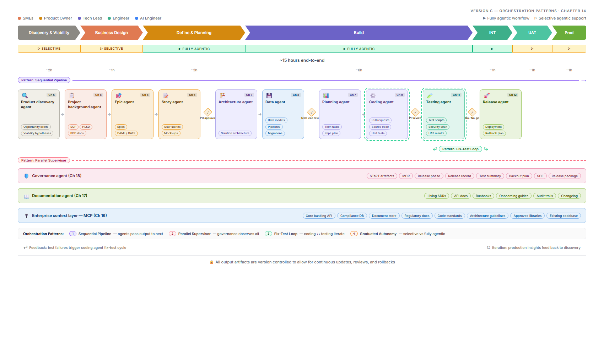

# Chapter 14: AI Agents in Production: Orchestration & Reliability

> *This chapter examines how AI agents operate as first-class product components — covering orchestration patterns, reliability engineering for non-deterministic systems, guardrails, and human-in-the-loop design.*

To make these patterns concrete, let us revisit the agentic SDLC architecture introduced in Chapter 1, this time annotated to highlight the orchestration patterns at work. This is not an abstract reference — it is the architecture of a real multi-agent system, and it employs three of the four patterns discussed above simultaneously.

> 📊 **Figure 14.1: Orchestration patterns in the Agentic SDLC Architecture.**
>
> 

Three patterns are visible in the architecture. The primary flow — from Product Discovery Agent through to Release Agent — follows the sequential pipeline pattern: each agent produces artifacts that become inputs for the next, with clear handoff boundaries. The Governance Agent operates as a parallel supervisor: it monitors every phase concurrently, consuming artifacts as they are produced and validating them against compliance requirements without blocking the main pipeline. The Coding Agent and Testing Agent form a fix-test loop — a localised iterative cycle within the broader sequential flow, where test failures trigger the coding agent to diagnose, fix, and resubmit until tests pass.

Note the graduated autonomy model visible in the phase bar. The Discovery and Business Design phases show selective agentic support (gray arrows) — these phases involve more human judgment and less AI autonomy. The Build phase is fully agentic (purple arrows) — AI agents handle the bulk of implementation work. The INT/UAT/Prod phases return to selective support, with human go/no-go gates governing progression to production. This graduated model reflects the enterprise reality that not all decisions carry equal risk, and human oversight should be concentrated where the consequences of error are highest.

The four human approval gates (amber diamonds) represent a critical design principle: even in a fully agentic workflow, certain handoff points require explicit human authorization. For CommercialEdge Bank, these gates are non-negotiable — regulatory requirements mandate human sign-off on architecture decisions affecting compliance data, code changes affecting customer-facing workflows, and any deployment to production environments.

