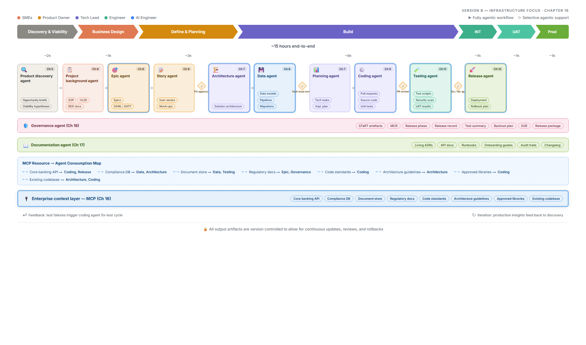

# Chapter 16: AI Agent Infrastructure: MCP, Tool Use & Enterprise Integration

> *This chapter dives into the enterprise context layer that powers every agent in the pipeline — the Model Context Protocol (MCP), tool-use patterns, custom extensions, and secure integrations with corporate systems.*

The diagram below shows how each MCP resource (Core Banking API, Compliance DB, code standards, etc.) is consumed by specific agents across the SDLC pipeline, emphasising the infrastructure that makes context-aware agentic workflows possible.

> 📊 **Figure 16.1 — Agentic SDLC Architecture: Infrastructure Focus**
>
> 

